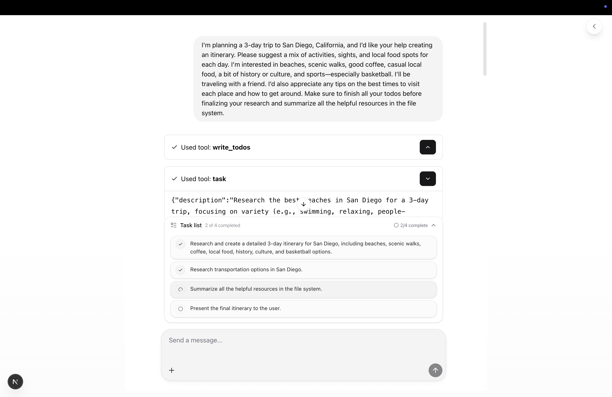
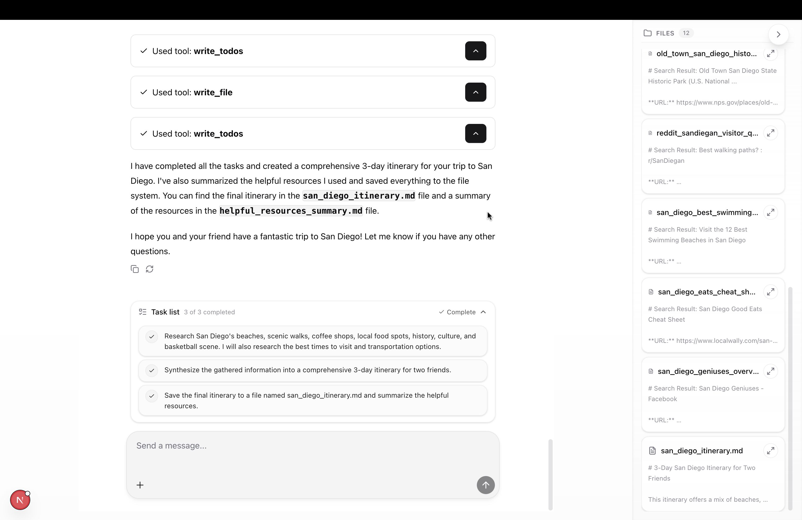
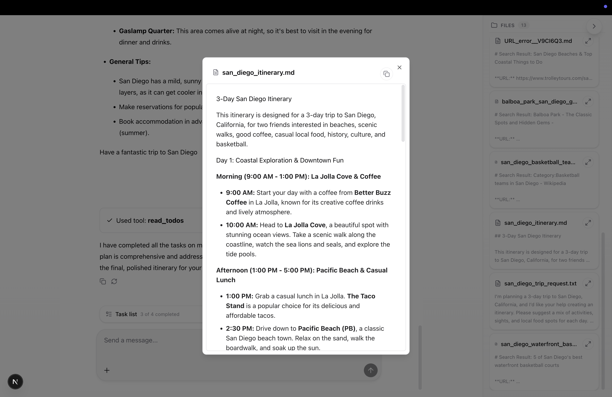

# Deep Agent Studio

_Built with ❤️ by [@artreimus](https://github.com/artreimus) from [Ylang Labs](https://github.com/ylang-labs)_

Production-ready example of a **LangGraph deep agent**: a research assistant that plans via TODOs, offloads context into a virtual file system, and delegates to scoped sub-agents. The backend exposes these capabilities through a LangGraph server; the frontend turns them into a polished assistant-ui experience.

## 📸 App

## Deep Agent Primer

Deep agents extend the classic ReAct loop with extra structure so they can tackle long-horizon tasks:

- **Structured planning:** The agent keeps a typed TODO list and think tool for planning.
- **Context offloading:** A virtual file system in graph state stores notes, drafts, and artifacts without ballooning token usage.
- **Delegated research:** A specialized sub-agent handles focused web research using Tavily and reflection tools while respecting concurrency limits.
- **Stateful UX:** The frontend subscribes to LangGraph updates to mirror todos and files in real time, so humans can co-pilot the workflow.

## Architecture

- `backend/` — LangGraph server hosting the deep researcher graph, reusable ReAct template, task delegation toolchain, and static assets for Studio.
- `frontend/` — Next.js 15 assistant-ui client that restores threads, shows TODO progress, previews generated files, and proxies API calls to the backend.

## Quick Start (Local)

### Backend (LangGraph server)

1. `cd backend`
2. `cp .env.example .env` and provide provider keys (`OPENAI_API_KEY`, `ANTHROPIC_API_KEY`, `TAVILY_API_KEY`, etc.)
3. Install dependencies: `uv sync`
4. Run checks: `make test` and `make lint`
5. Start the server: `make run-dev` → LangGraph Studio, API, and docs at `http://127.0.0.1:2024`

### Frontend (Assistant UI)

1. `cd frontend`
2. `cp .env.example .env.local` and set:
   - `LANGGRAPH_API_URL=http://127.0.0.1:2024`
   - `NEXT_PUBLIC_LANGGRAPH_ASSISTANT_ID="Deep Researcher"`
   - `LANGCHAIN_API_KEY=...` when routing through the Next.js proxy
   - Optional: `NEXT_PUBLIC_LANGGRAPH_API_URL=...` for direct browser calls (requires CORS and API key handling)
3. Install dependencies: `pnpm install` (npm or yarn also work)
4. Launch the UI: `pnpm dev` → open `http://localhost:3000`

Ask a research question to watch the agent plan tasks, delegate subtasks, and surface artifacts in the sidebar.

## Environment Variables

### Backend `.env`

- Model providers: `OPENAI_API_KEY`, `ANTHROPIC_API_KEY`, `GOOGLE_API_KEY`, `OPENROUTER_API_KEY`, `GROQ_API_KEY`
- Search: `TAVILY_API_KEY` (default research tool) plus any additional provider keys you add
- LangSmith and tracing: `LANGSMITH_API_KEY`, `LANGSMITH_PROJECT`, `LANGSMITH_TRACING`

### Frontend `.env.local`

- `LANGGRAPH_API_URL` — Base URL for the LangGraph server (proxied through Next.js)
- `LANGCHAIN_API_KEY` — Injected as `x-api-key` when the proxy forwards requests
- `NEXT_PUBLIC_LANGGRAPH_ASSISTANT_ID` — Defaults to `"Deep Researcher"` from `backend/langgraph.json`
- `NEXT_PUBLIC_LANGGRAPH_API_URL` — Optional direct browser target if you manage CORS and secret handling yourself

## Development Workflow

- Backend: `make test`, `make lint`, `make format`, `make test TEST_FILE=tests/unit_tests/test_feature.py`
- Frontend: `pnpm dev`, `pnpm lint`, `pnpm build`
- Update supporting docs in `docs/` or `AGENTS.md` when evolving processes or tooling

## Deployment

- **Backend:** Deploy via LangGraph Cloud/Platform for durability or self-host behind your own gateway. Enforce `x-api-key` headers if the API is public.
- **Frontend:** Deploy to any Node-compatible host (Vercel, Netlify, etc.) and point environment variables at the hosted LangGraph server. The built-in `/api` proxy keeps credentials server-side.

## License

This project is licensed under the MIT License. See the [LICENSE](LICENSE) file for details.

---

**⭐ If you find this project useful, please give it a star! ⭐**

Built with ❤️ by [@artreimus](https://github.com/artreimus) from [Ylang Labs](https://github.com/ylang-labs)

